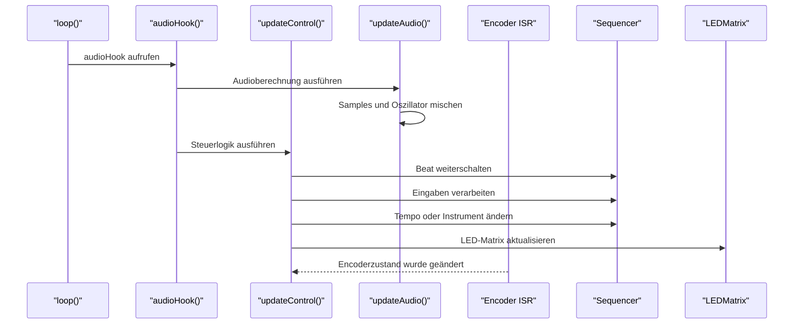
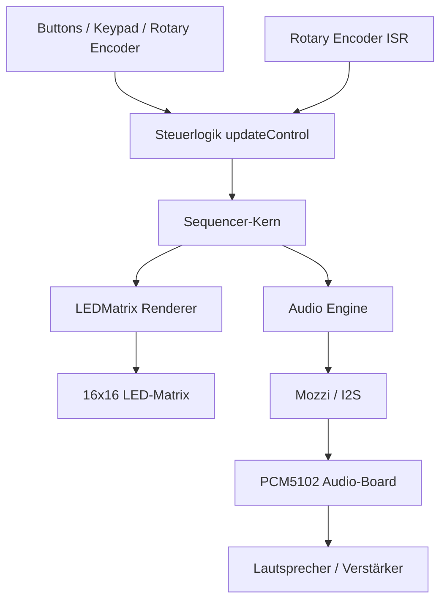

# Kleine Groovebox / Drumbox

## Projektbeschreibung

Dieses Projekt entstand im Rahmen des Belegs **„Programmierung von Mikrocontrollern“**. Ziel war die Entwicklung einer kleinen Groovebox auf Basis eines Mikrocontrollers. Die Groovebox ermöglicht das Programmieren und Abspielen einfacher rhythmischer Patterns mit mehreren Instrumenten.

Die Bedienung erfolgt primär über Buttons, eine 16x16-LED-Matrix als Anzeige sowie einen Drehregler zur Einstellung der Geschwindigkeit. Die Audioausgabe wird in Echtzeit erzeugt und über ein externes Audio-Board ausgegeben.

## Funktionsumfang

Die Groovebox verfügt über insgesamt fünf spielbare Instrumente:

* vier Drum-Sounds
* einen einfachen Ton zur Erstellung rudimentärer Melodien

Ein Loop besteht grundsätzlich aus 16 Schritten, die fortlaufend wiederholt werden. Während der Wiedergabe können Änderungen am Pattern vorgenommen werden. Dadurch ist es möglich, den Loop live zu verändern, ohne die Wiedergabe stoppen zu müssen.

Zusätzlich kann die Wiedergabe pausiert und später an derselben Stelle fortgesetzt werden. Der Loop muss außerdem nicht zwingend alle 16 Schritte verwenden, sondern kann mithilfe eines Limiters auf eine gewünschte Länge begrenzt werden.

## Bedienung

### Instrumentenauswahl

Die Auswahl eines Instruments erfolgt über die vertikal angeordneten Buttons. Jede Zeile entspricht dabei einer Funktion beziehungsweise einem Instrument:

1. Drum 1
2. Drum 2
3. Drum 3
4. Drum 4
5. Ton / Melodie
6. Limiter

Nach dem Auswählen eines Instruments kann über die 16 horizontalen Buttons festgelegt werden, an welchem Schritt des Loops das jeweilige Instrument aktiv sein soll.

Beim Melodie-Instrument wird zusätzlich der aktuell ausgewählte Ton für den jeweiligen Schritt gespeichert.

### Step-Sequencer

Der Sequencer arbeitet mit 16 Schritten. Jeder Schritt entspricht einem Beat innerhalb des Loops. Durch Drücken eines horizontalen Buttons wird der entsprechende Schritt für das aktuell ausgewählte Instrument aktiviert oder deaktiviert.

Während der Loop läuft, können Steps weiterhin verändert werden. Der Sequencer übernimmt diese Änderungen direkt in die laufende Wiedergabe.

### Tonwahl

Die Auswahl der Töne erfolgt über eine 4x4-Button-Matrix. Zwölf dieser Buttons werden verwendet, um verschiedene Töne auszuwählen. Beim Drücken eines Ton-Buttons wird ein kurzer Beispielton abgespielt, sodass direkt hörbar ist, welcher Ton ausgewählt wurde.

Der ausgewählte Ton wird gespeichert, wenn anschließend ein Step in der Ton-Zeile aktiviert wird.

### Pause und Tempo

Auf derselben 4x4-Button-Matrix befinden sich zusätzlich Steuerbuttons für die Wiedergabe:

* Pause / Weiter
* Tempo halbieren
* Tempo verdoppeln

Beim Pausieren stoppt die Wiedergabe auf dem aktuellen Schritt. Beim erneuten Drücken wird der Loop an dieser Stelle fortgesetzt.

Für feinere Tempoänderungen gibt es zusätzlich einen separaten Drehregler. Dieser besitzt ein haptisches Klick-Feedback und verändert die Geschwindigkeit schrittweise um jeweils einen BPM-Wert.

## LED-Matrix

Der aktuelle Zustand des Loops wird auf einer 16x16-LED-Matrix dargestellt. Jedes Instrument besitzt eine eigene Zeile und eine eigene Farbe. Dadurch ist gut erkennbar, welche Steps für welches Instrument aktiv sind.

Ein zusätzlicher Läufer zeigt den aktuell abgespielten Beat an. So kann der zeitliche Ablauf des Loops direkt visuell verfolgt werden.

## Audioausgabe

Die Audioausgabe erfolgt über ein externes AUX- beziehungsweise I2S-Audio-Board vom Typ **PCM5102**. Das Board gibt ein reines Audiosignal aus.

Es erfolgt keine eigene Stromversorgung oder größere Verstärkung für passive Lautsprecher. Der angeschlossene Lautsprecher oder Verstärker muss daher in der Lage sein, das Audiosignal selbst weiterzuverarbeiten beziehungsweise zu verstärken.

## Beschreibung der Nebenläufigkeit

Die Groovebox verwendet keine klassischen Threads, sondern eine interrupt- und callbackbasierte Nebenläufigkeit. Die zeitkritischste Aufgabe ist die Audiogenerierung durch Mozzi.

Die Funktion `updateAudio()` wird regelmäßig von der Audio-Engine aufgerufen und erzeugt das aktuelle Audiosignal. Dabei werden mehrere Samples sowie ein Oszillatorsignal in Echtzeit gemischt. Da diese Funktion mit hoher Frequenz ausgeführt wird, darf sie nur kurze Berechnungen enthalten. Andernfalls könnten Audioaussetzer oder Knackgeräusche entstehen.

Die Steuerlogik ist davon getrennt und wird in `updateControl()` mit einer niedrigeren Frequenz ausgeführt. Dort werden Eingaben verarbeitet, der Sequencer weitergeschaltet, Samples gestartet, LEDs aktualisiert und das aktuelle Tempo angepasst.

Zusätzlich wird der Rotary Encoder über eine Interrupt-Service-Routine verarbeitet. Diese ISR ist bewusst kurz gehalten und delegiert nur das Auslesen des Encoderzustands an die Encoder-Bibliothek. Die eigentliche Verarbeitung der Tempoänderung erfolgt anschließend außerhalb des Interrupts in der normalen Steuerlogik.

Weitere nebenläufig wirkende Abläufe entstehen durch kooperatives Scheduling mit `millis()`. Buttonabfragen, LED-Aktualisierung und Sequencer-Fortschritt werden in unterschiedlichen Zeitintervallen ausgeführt. Dadurch blockiert keine dieser Aufgaben dauerhaft den Programmfluss.

Gemeinsame Zustände wie `currentBeat`, `activeInstrument`, `noteMatrix`, `tempo` und die Audioobjekte werden von mehreren Programmteilen verwendet. Deshalb muss darauf geachtet werden, dass zeitkritische Daten konsistent bleiben und lange blockierende Operationen wie I2C-Zugriffe, serielle Ausgaben oder LED-Updates die Audiowiedergabe nicht stören.

## Architekturmuster

Die Software der Groovebox ist ereignisgesteuert aufgebaut und trennt die Verantwortlichkeiten schichtweise. Zentral ist der Sequencer als fachlicher Kern der Anwendung. Er speichert den aktuellen Beat, das aktive Instrument sowie die Notenmatrix.

Alle Eingaben über Buttons, Keypad, Rotary Encoder und serielle Schnittstelle werden in der Steuerlogik verarbeitet. Diese Eingaben verändern den Zustand des Sequencers.

Die Ausgaben sind vom Sequencer-Kern getrennt. Die LED-Matrix liest den aktuellen Sequencer-Zustand aus und stellt aktive Schritte, das aktive Instrument und den aktuellen Beat visuell dar. Die Audio-Engine verwendet den Sequencer-Zustand, um Samples oder Oszillatorsignale zum richtigen Zeitpunkt zu starten und im Audio-Callback zu mischen.

Die zeitliche Steuerung erfolgt ereignis- und callbackbasiert. Die Funktion `updateControl()` übernimmt langsamere Steuerungsaufgaben wie Eingabeverarbeitung, Step-Fortschritt und LED-Aktualisierung. Die Funktion `updateAudio()` ist für die zeitkritische Audioberechnung zuständig. Der Rotary Encoder wird zusätzlich über eine Interrupt-Service-Routine erfasst.

Dadurch werden Audioverarbeitung, Eingabeverarbeitung und visuelle Ausgabe logisch getrennt, obwohl das System ohne explizite Threads auf einem Mikrocontroller läuft.

## Architekturübersicht

## Zusammenfassung

Die Groovebox kombiniert einen einfachen Step-Sequencer mit Echtzeit-Audioausgabe und visueller Rückmeldung über eine LED-Matrix. Durch die Trennung von Sequencer-Kern, Eingabeverarbeitung, Audio-Engine und LED-Ausgabe bleibt die Software übersichtlich strukturiert.

Die interrupt- und callbackbasierte Nebenläufigkeit ermöglicht es, Audio zuverlässig in Echtzeit auszugeben, während gleichzeitig Buttons, Drehregler und LED-Anzeige verarbeitet werden.
